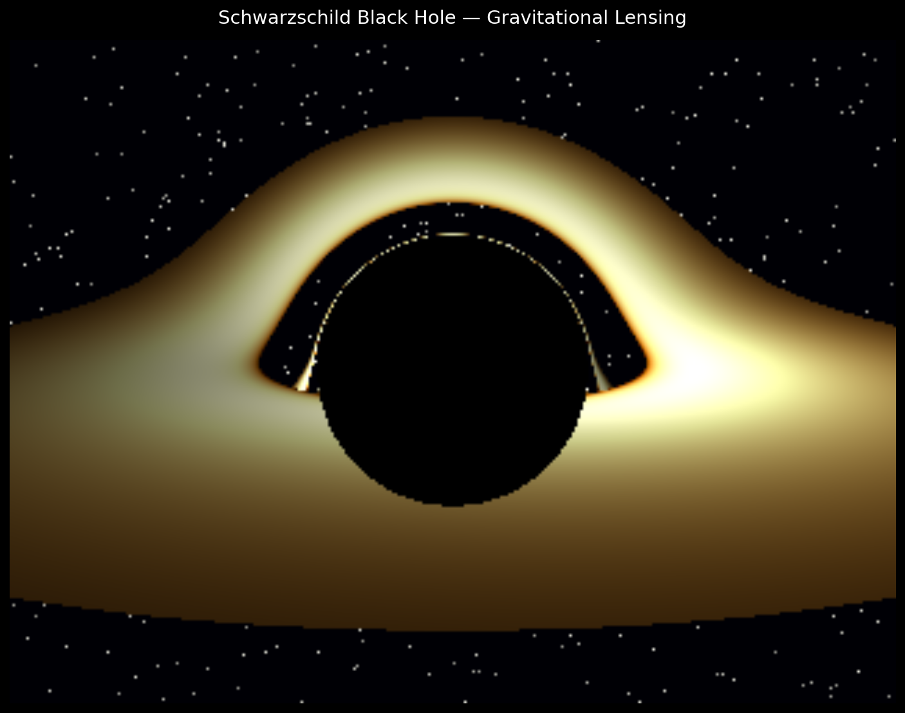

# Hlack-Bole

A physically accurate Schwarzschild black hole renderer built in Python. The engine numerically integrates photon geodesics in curved spacetime and produces gravitational lensing images, including the black hole shadow, accretion disk, and a procedural star field.



---

## Overview

This project simulates light propagation around a non-rotating black hole using General Relativity. For each pixel in the output image, a photon ray is traced backwards from the camera through curved spacetime. The trajectory is determined by the Schwarzschild geodesic equations, integrated numerically using RK45. The photon is then classified as either captured by the black hole, escaped to infinity, or intercepted by the accretion disk.

**Physics model:** Schwarzschild metric in geometrised units (G = c = 1)

**Key effects rendered:**
- Gravitational lensing of background stars
- Black hole shadow (photon capture region)
- Thin accretion disk with Novikov-Thorne temperature profile
- Doppler-like azimuthal brightness variation on the disk
- Gravitational redshift via radial brightness falloff

---

## Project Structure

```
Hlack-Bole/
├── main.py                      # Entry point and CLI
├── requirements.txt
├── output/
│   └── lensing_render.png
├── core/
│   ├── camera.py                # Pinhole camera, ray direction computation
│   └── engine.py                # Render loop orchestrator
├── physics/
│   ├── schwarzschild.py         # Metric, radii, effective potential
│   ├── geodesic.py              # Christoffel symbols, geodesic ODE
│   └── photon.py                # Photon data model and fate enum
├── bh_math/
│   ├── vectors.py               # Coordinate transforms, vector utilities
│   └── integrator.py            # SciPy ODE wrapper
├── simulation/
│   ├── ray_emitter.py           # Camera-to-spherical photon initialisation
│   └── trajectory_solver.py     # Geodesic integration, disk/horizon detection
└── renderer/
    ├── disk.py                  # Accretion disk colour model
    ├── lensing_renderer.py      # Pixel colour assignment from photon fate
    └── plot_renderer.py         # Matplotlib output and trajectory plots
```

---

## Installation

```bash
git clone <repo-url>
cd Hlack-Bole
pip install -r requirements.txt
```

**Requirements:** Python 3.11+

```
numpy>=1.24
scipy>=1.10
matplotlib>=3.7
```

---

## Usage

```bash
# Quick render at default resolution (160×120)
python main.py

# Medium quality
python main.py --resolution 320x240

# High quality
python main.py --resolution 640x480

# Custom camera setup
python main.py --resolution 320x240 --inclination 85 --distance 25 --disk-outer 18
```

### CLI Options

| Flag | Default | Description |
|---|---|---|
| `--resolution` | `160x120` | Output image size (WxH) |
| `--fov` | `60` | Horizontal field of view in degrees |
| `--mass` | `1.0` | Black hole mass in geometrised units |
| `--distance` | `30.0` | Camera distance from black hole (units of M) |
| `--inclination` | `80.0` | Camera polar angle from the spin axis |
| `--disk-outer` | `20.0` | Outer radius of accretion disk (units of M) |
| `--output` | `output/lensing_render.png` | Output file path |

Render time scales roughly as O(W × H). A 160×120 render completes in seconds; 640×480 takes several minutes on a single CPU core.

---

## Physics Reference

The Schwarzschild line element in geometrised units:

```
ds² = -(1 - 2M/r) dt² + (1 - 2M/r)⁻¹ dr² + r² dθ² + r² sin²θ dφ²
```

| Quantity | Value | Physical meaning |
|---|---|---|
| Event horizon | r = 2M | Photons inside are not traced |
| Photon sphere | r = 3M | Unstable circular photon orbit |
| ISCO | r = 6M | Inner edge of the accretion disk |
| Critical impact parameter | bₐ = 3√3 M | Photons with b < bₐ are captured |

Photon motion is governed by the null geodesic equation:

```
d²x^μ/dλ² + Γ^μ_{αβ} (dx^α/dλ)(dx^β/dλ) = 0
```

The Christoffel symbols `Γ^μ_{αβ}` are computed analytically from the Schwarzschild metric. The null condition `g_{μν} dx^μ dx^ν = 0` is enforced at each integration step to reconstruct `dt/dλ`.

---

## Rendering Pipeline

```
For each pixel (i, j):
  1. Camera.ray_direction(i, j)          → Cartesian unit ray vector
  2. emit_ray(pos, dir, M)               → Photon in spherical coords
  3. solve_photon(photon, M, ...)        → Integrate geodesic (RK45)
     ├─ horizon event → PhotonFate.CAPTURED
     ├─ escape event  → PhotonFate.ESCAPED
     └─ disk crossing → PhotonFate.HIT_DISK
  4. compute_pixel_color(photon)         → RGB value
     ├─ CAPTURED  → black
     ├─ HIT_DISK  → disk_color(r, φ)    (Novikov-Thorne + Doppler)
     └─ ESCAPED   → background_color(θ, φ) (procedural stars)
  5. Write pixel to image buffer
```

---

## Development Roadmap

### Phase 1 — Library-Based Renderer (current)

- [x] Schwarzschild metric and Christoffel symbols
- [x] Full 3D geodesic ODE solver (RK45 via SciPy)
- [x] Event horizon and escape detection
- [x] Thin accretion disk (ISCO to outer radius)
- [x] Novikov-Thorne temperature profile
- [x] Doppler-like azimuthal brightness variation
- [x] Procedural star field for escaped rays
- [x] CLI with configurable camera and physics parameters

### Phase 2 — Physical Accuracy

- [ ] Gravitational redshift on disk emission
- [ ] Relativistic Doppler shift (full formula)
- [ ] Relativistic beaming
- [ ] Physically shaded frames

### Phase 3 — Real-Time Renderer

- [ ] Interactive camera (pygame / moderngl)
- [ ] GPU-accelerated ray tracing
- [ ] Kerr metric (rotating black holes)

### Phase 4 — From-Scratch Engine

- [ ] Custom vector and matrix library
- [ ] Custom Runge–Kutta integrator
- [ ] Custom pixel buffer and rasteriser
- [ ] No external dependencies

---

## Output

The renderer writes a PNG to `output/lensing_render.png` by default. The image is saved via matplotlib with a black background at 150 DPI.

For trajectory visualisation and effective-potential plots, use the utilities in `renderer/plot_renderer.py` directly.

---

## License

MIT


Implement:

* spatial partitioning
* multithreading
* fixed-step integrator tuning

### Stage 6 — Engine Architecture

Structure modules:

```md
math/
physics/
renderer/
core/
```

### Stage 7 — Verification

Check:

* light deflection angle vs theory
* orbit stability
* energy conservation

---

## Skill Stack Required

* Differential geometry
* Numerical methods
* Computational physics
* Linear algebra
* Rendering pipelines

---

## Final Deliverables

Phase 1 → Accurate simulation using tools
Phase 2 → Fully self-built relativistic rendering engine

---
